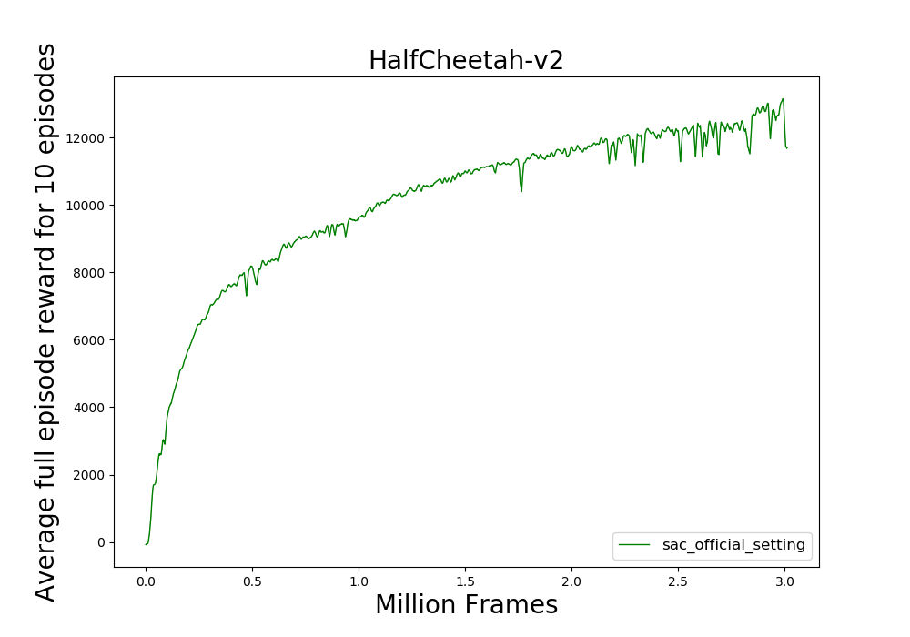

# TorchRL

Pytorch Implementation for RL Methods

Environments with continuous & discrete action space are supported.

Environments with 1d & 3d observation space are supported.

Multi-Process data-collector is supported

## Update

asynchronous sampling and evaluation for off-policy methods is supported.

## Requirements
1. General Requirements
* Pytorch 1.4
* Gym(0.10.9)
* Mujoco(1.50.1)
* tabulate (for log)
* tensorboardX (log file output)
2. Tensorboard Requirements
* Tensorflow: to start tensorboard or read log in tf records

## Installation
1. use 
use **environment.yml** to create virtual envrionment
```
    conda create -f environment.yml
    source activate py_off
```

2. Mannually install all requirements


## Usage
specify parameters for algorithms in config file & specify log directory / seed / device in argument

```
    python examples/example_para_sac.py --config config/sac_halfcheetah.json --seed 0 --device 0
```

Checkout examples folder for detailed informations

## Currently contains:
* On-Policy Methods:
    * Reinforce
    * A2C(Actor Critic)
    * PPO(Proximal Policy Optimization)
    * TRPO
* Off-Policy Methods:
    * Soft Actor Critic: SAC(TwinSAC)
    * Deep Deterministic Policy Gradient :DDPG
    * TD3
    * DQN:
        * Basic Double DQN
        * Bootstrapped DQN
        * QRDQN

## Figure:


## TODO:
1. Add More Algorithm
    * On-Policy Methods:
        * A3C
    * DQN: C51 / IQN
2. Add multiprocess support for environments - finished
3. Different experience replay buffer:
    * Priotized experience replay
    * HER
